<code>avi@github ~ $ whoami</code>

 

<!-- Side-by-Side Balanced Proportional Panels — bordered -->

  
  

 

  <code>avi@github ~ $ ./links.sh</code>

<h3 align="center">Fullstack Developer · Building at the Intersection of Design & Engineering · Open Source Contributor</h3>

  
  

<!-- Command Line Style Navigation Buttons -->

  
  
  

  
  

 

---

<h2 align="center">💻 Technical Dashboard</h2>

<h3 align="center">🛠️ Core Stack</h3>

  
  
  
  
  
  

<h3 align="center">⚙️ Backend & Data</h3>

  
  
  
  
  
  

<h3 align="center">🚀 Infrastructure & Deployment</h3>

  
  
  
  

 

---

<code>avi@github ~ $ echo "Thanks for stopping by — let's build something." > README.md</code>

  

