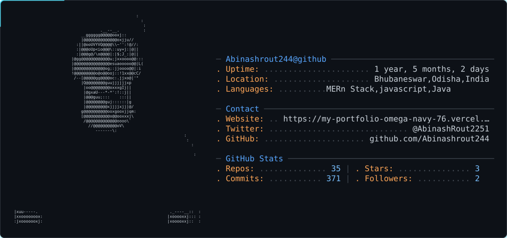

<!-- ASCII Profile Card (Dark/Light Responsive, animated via animate_card.py) -->
<picture>
  <source media="(prefers-color-scheme: dark)" srcset="dark_mode_scan_new.svg" />
  <source media="(prefers-color-scheme: light)" srcset="light_mode.svg" />
  
</picture>

 

<!-- Infinite blurred glow reveal bar, sweeping left -> right -->

  

<!-- Dynamic Infinite Animated Typing Header -->

  <em>Passionate Full-Stack Developer crafting high-performance, modern web experiences with clean architecture and liquid-smooth UI.</em>

<!-- Infinite Looping Animated Wave Divider -->

### ⚡ About Me

* 🔭 Currently building **scalable full-stack applications** with the **MERN Stack & JAVA**.
* 🎨 Passionate about creating **modern, responsive UIs, smooth animations, glassmorphism, and micro-interactions**.
* ⚙️ Exploring **Next.js, Server Components, REST APIs, real-time applications, Socket.IO, authentication, and scalable backend architecture**.
* 🧠 Currently strengthening my **DSA, problem-solving, and system design** skills through consistent practice.
* 💬 Ask me about **React, React.js, JavaScript, Node.js, Express.js, MongoDB, Tailwind CSS, or REST APIs**.
* 🚀 I enjoy turning ideas into **clean, performant, and production-ready web applications**.
* 🤝 Always open to collaborating on **interesting full-stack, open-source, and innovative web projects**.

---

### 🛠️ Tech Stack & Arsenal

#### Frontend & UI

#### Backend & Database

#### Cloud, DevOps & Tools

---

### 📊 GitHub Activity & Metrics

  
  

 

  

---

<!-- Looping Footer Wave Divider -->

  

  Crafted with passion by <a href="https://github.com/Abinashrout244">Abinash Rout</a>

